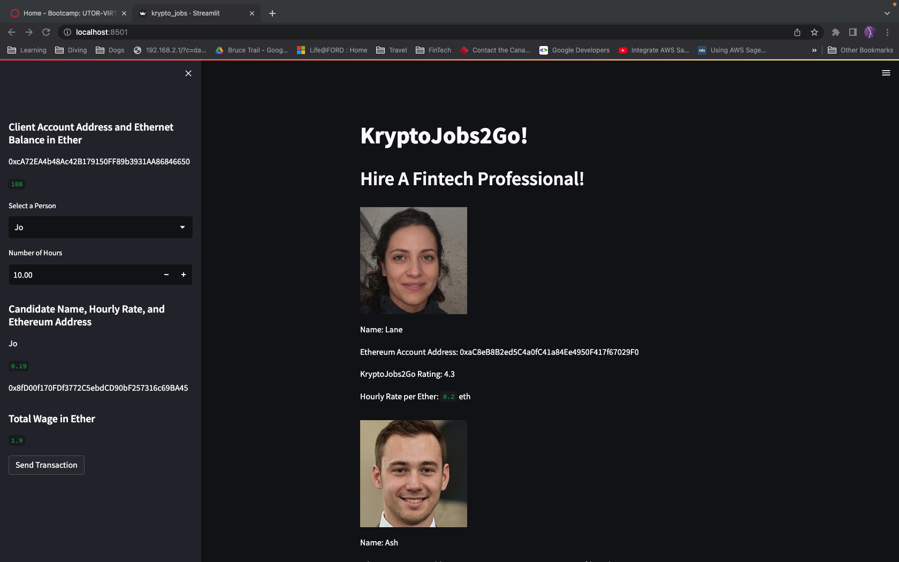
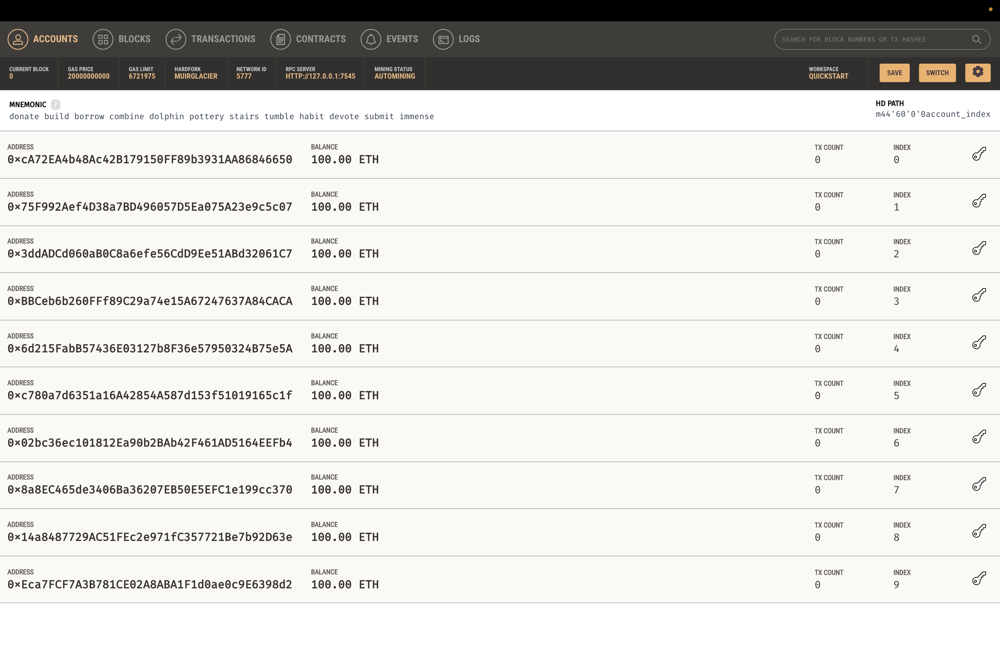
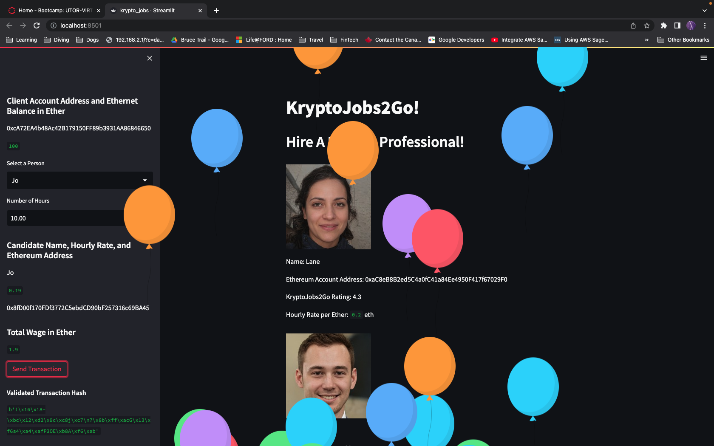
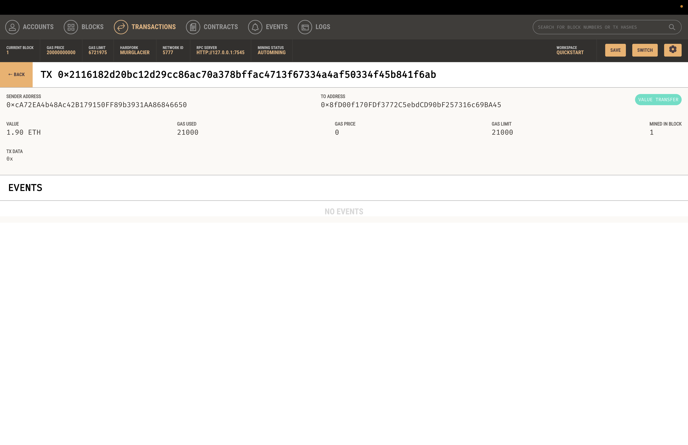

## Unit 19 Homework: Cryptocurrency Wallet

### Background

You work at a startup that is building a new and disruptive platform called KryptoJobs2Go. KryptoJobs2Go is an application that its customers can use to find fintech professionals from among a list of candidates, hire them, and pay them. As KryptoJobs2Go’s lead developer, you have been tasked with integrating the Ethereum blockchain network into the application in order to enable your customers to instantly pay the fintech professionals whom they hire with cryptocurrency.

In this Challenge, you will complete the code that enables your customers to send cryptocurrency payments to fintech professionals. To develop the code and test it out, you will assume the perspective of a KryptoJobs2Go customer who is using the application to find a fintech professional and pay them for their work.

### Instructions
Full instructions included in the Instructions.md file.

#### Transaction Details

## Test the KryptoJobs2Go application with your newly integrated Ethereum wallet. 

Starting view of the Streamlit application

Starting view of the Ganache Application

On the resulting webpage, select a candidate that you would like to hire from the appropriate drop-down menu. Then, enter the number of hours that you would like to hire them for. 

Click the Send Transaction button to sign and send the transaction with your Ethereum account information. Navigate to the Transactions section of Ganache.

Streamlit Success Balloons

* Take a screenshot of your address balance and history on Ganache. Save this screenshot to the README.md file of your GitHub repository for this Challenge assignment.

* Take a screenshot of the transaction details on Ganache. Save this screenshot to the README.md file of your GitHub repository for this Challenge assignment.

